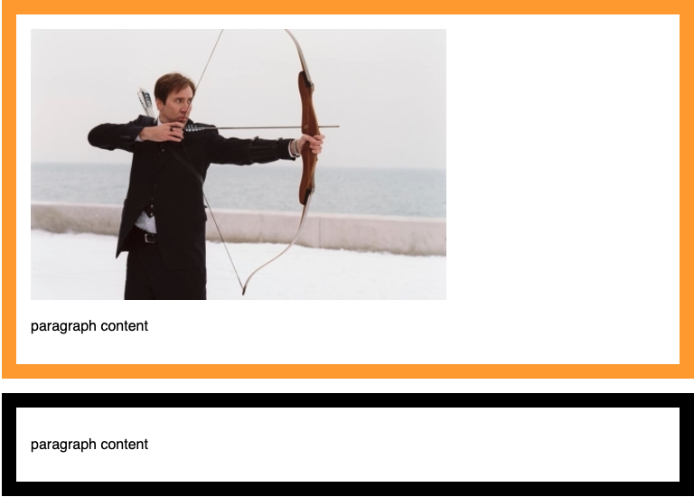
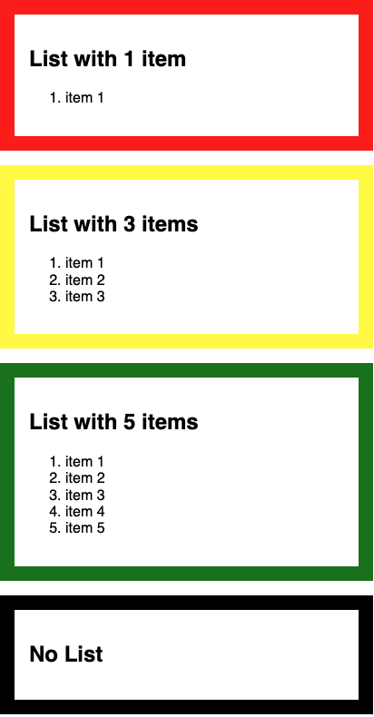
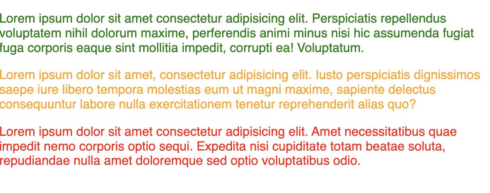

CSS is getting even more powerful in 2022. Here are three new pseudo selectors that'll help you. :is(), :where(), and :has(). Without further ado, I'll explain what they are and how you can use them.

<!--truncate-->

## :has() pseudo selector

### What is it?

Have you ever wanted to style a parent element based on the content of its content? Previously the only way to style a parent if it had something inside it would be to use JavaScript. Now with the :has() pseudo selector you can style a parent based its children.

### How can you use it?

#### Simple

<div class="grid grid--half">
  <div>
  <p><strong>HTML</strong></p>

  ```html
  <!--this div will be styled-->
  <div class="parent">
    

    <p>paragraph content</p>
  </div>

  <!--this div won't be styled-->
  <div class="parent">
    <p>paragraph content</p>
  </div>
  ```

  </div>
  <div>
<p><strong>CSS</strong></p>

```css
.parent {
	border: 1em solid black;
	padding: 1em;
	margin-bottom: 1em;
}

.parent:has(img) {
	border-color: orange;
}
```
</div>
</div>

[Result (in a Browser that supports it)](https://codepen.io/bigandy/pen/MWrvjQZ):



#### Complex

We can get even more complex. You can style the parent based on the number of list items a list has:

<div class="grid grid--half">
<div>
<p><strong>HTML</strong></p>

```html
<div class="block">
  <h2>List with 1 item</h2>

  <ol>
    <li>item 1</li>
  </ol>
</div>

<div class="block">
  <h2>List with 3 items</h2>

  <ol>
    <li>item 1</li>
    <li>item 2</li>
    <li>item 3</li>
  </ol>
</div>

<div class="block">
  <h2>List with 5 items</h2>

  <ol>
    <li>item 1</li>
    <li>item 2</li>
    <li>item 3</li>
    <li>item 4</li>
    <li>item 5</li>
  </ol>
</div>

<div class="block">
  <h2>No List</h2>
</div>
```

</div>

<div>
<p><strong>HTML</strong></p>

```css
.block {
  border: 1em solid var(--border-color, black);
  margin-bottom: 1em;
  padding: 1em;
}
.block:has(li) {
  --border-color: red;
}
.block:has(li:nth-child(2)) {
  --border-color: orange;
}
.block:has(li:nth-child(3)) {
  --border-color: yellow;
}
.block:has(li:nth-child(5)) {
  --border-color: green;
}
```

</div>
</div>

[Result (in a Browser that supports it)](https://codepen.io/bigandy/pen/VwyzaXQ?editors=0100):



### Demos

- https://codesandbox.io/s/crazy-pike-70i051?file=/src/styles.scss
- https://codepen.io/bigandy/pen/VwyzaXQ?editors=0100
- https://codepen.io/bigandy/pen/MWrvjQZ

### Further information

- Browser support: [Safari 15.4+](https://developer.apple.com/documentation/safari-release-notes/safari-15_4-release-notes), Chrome 101+ with the Experimental Web Platform features flag enabled (type chrome://flags/#enable-container-queries into the url bar in Chrome 101+ and enable it if is not already enabled)
- Support Link: https://caniuse.com/css-has
- Spec Link: https://www.w3.org/TR/selectors-4/#relational


## :is() pseudo selector

### What is it?

<p>Both :is() and :where() allow you to group selectors.</p>

<div class="grid grid--half">
<div>

<p>Previously if you wanted to select every heading element you would have to write</p>
<p><strong>previously</strong></p>

```css
h1,
h2,
h3,
h4,
h5,
h6 {
  font-family: serif;
}
```

</div>
<div>

<p>but now you can use the :is() pseudo selector to write in much less lines of code:</p>

<p><strong>now</strong></p>

```css
:is(h1, h2, h3, h4, h5, h6) {
  font-family: serif;
}

```
</div>
</div>

### Further information
- Browser Support: Edge, Chrome, Safari, Firefox. All the good ones!
- Support Links: https://caniuse.com/css-matches-pseudo
- Spec Link: https://www.w3.org/TR/selectors-4/#matches

## :where() pseudo selector

The :where() pseudo selector allows you to select a number of different elements, but it (the :where()) has no extra specificity.

<div class="grid grid--half">
<div>

<p><strong>HTML</strong></p>

```html
<div class="block">

	<p>Lorem ipsum dolor sit amet consectetur adipisicing elit. Perspiciatis repellendus voluptatem nihil dolorum maxime, perferendis animi minus nisi hic assumenda fugiat fuga corporis eaque sint mollitia impedit, corrupti ea! Voluptatum.</p>

	<p class="intro">Lorem ipsum dolor sit amet, consectetur adipisicing elit. Iusto perspiciatis dignissimos saepe iure libero tempora molestias eum ut magni maxime, sapiente delectus consequuntur labore nulla exercitationem tenetur reprehenderit alias quo?</p>

	<p id="lead">Lorem ipsum dolor sit amet consectetur adipisicing elit. Amet necessitatibus quae impedit nemo corporis optio sequi. Expedita nisi cupiditate totam beatae soluta, repudiandae nulla amet doloremque sed optio voluptatibus odio.</p>
</div>

```

</div>
<div>

<p><strong>CSS</strong></p>

```css
/* specificity of (1,0,0) */
#lead {
	color: red;
}

/* specificity of (0,1,0) */
.intro {
	color: orange;
}

/* specificity of (0,0,1) */
p {
	color: black;
}

/* The :where() has a specificity reset for the elements inside so only the specificty of `body` is taken into consideration
  as this rule is after the rule for the `p` it overrules due to location rather than specificity. */
  /* this gives a specicity of (0,0,1) */
body :where(#lead, .intro, p) {
	color: green;
}


```
</div>
</div>

[Result (in a Browser that supports it)](https://codepen.io/bigandy/pen/jOYLVPd):




### Links
- https://web.dev/css-is-and-where/
- https://stuffandnonsense.co.uk/archives/css_specificity_wars.html
- Browser Support: Edge, Chrome, Safari, Firefox. All the good ones!
- Support Links: https://caniuse.com/mdn-css_selectors_where
- Spec Link: https://www.w3.org/TR/selectors-4/#zero-matches


### The difference between :is() and :where()

- :where() has no specificity so that the specificity of `body :where(p) {} ` and `body {}` are the same.
- :where() squashes specificity to no specificity for the list passed to where. For example `body :where(p, .lead, #introText) {}` would all have the same specicity and be the same as `body {}`
- :is() takes the specificity of its most specific selector so that if `body nav:is(.top-nav, #topNav) {}` the rule would have the equivalent specificity of `body nav#topNav` (not body nav.top-nav as you might normally expect)

